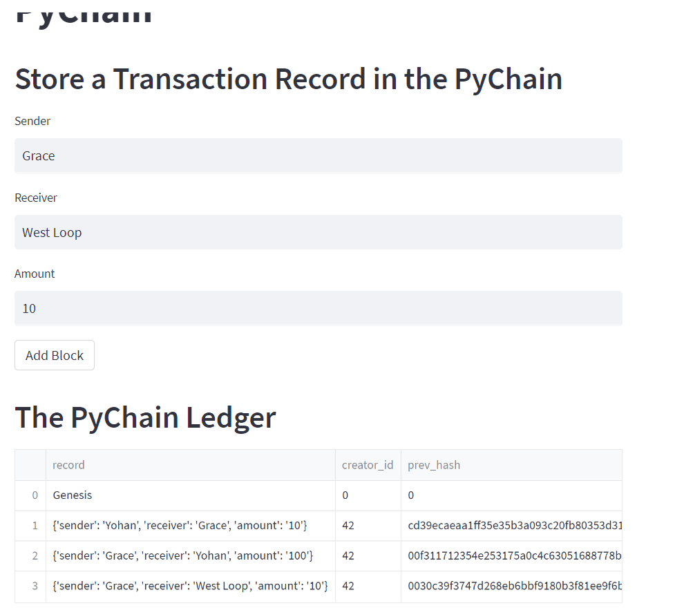
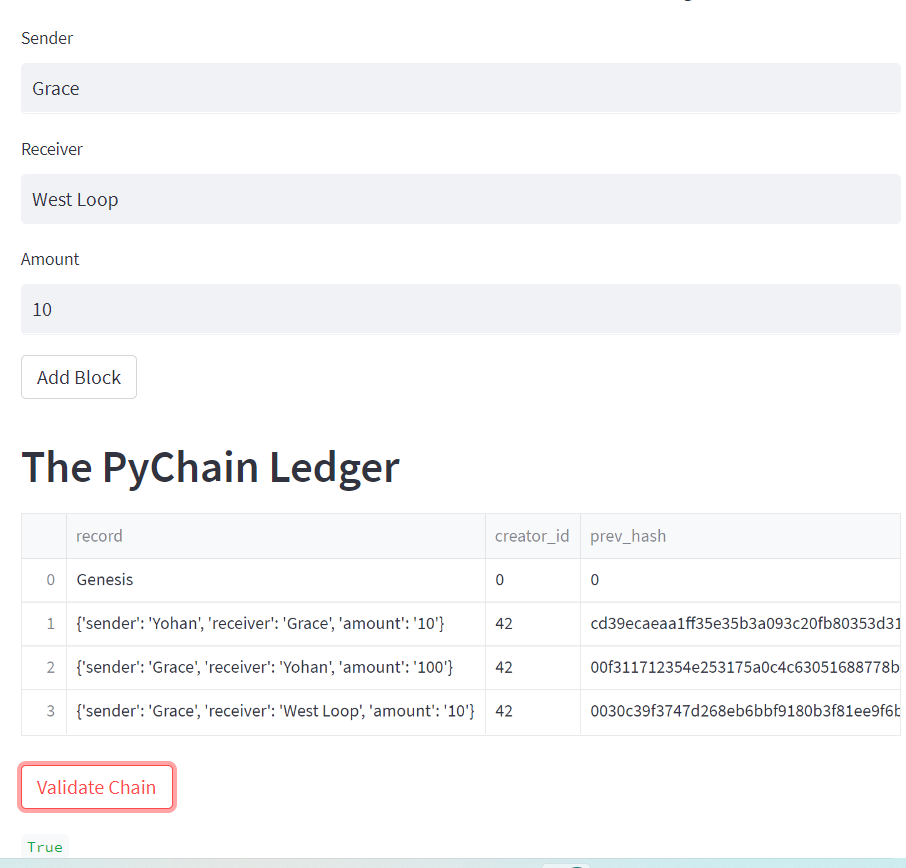

# Blockchain_Ledger
This was a homework assignment done under Northwestern's Fintech Bootcamp

Here are the screenshots:

This one shows 3 different block created:

This one shows them validated with "True" at the bottom:

